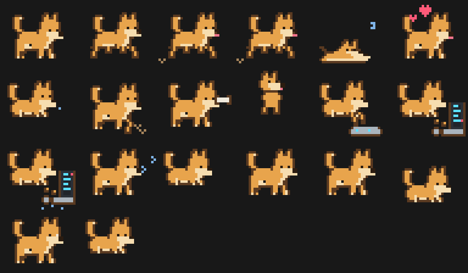
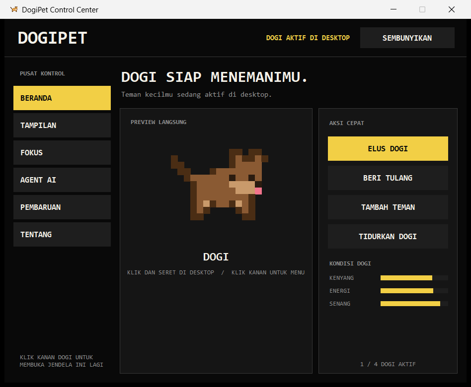
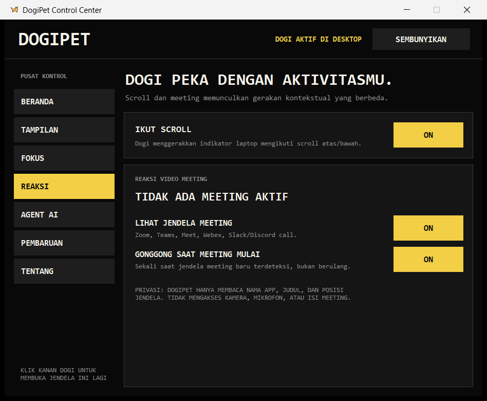

# DogiPet

DogiPet adalah anjing piksel yang hidup di desktop Windows. Ia berjalan,
tidur, mengikuti kursor, bereaksi saat kamu mengetik, mengingatkan waktu
istirahat, menyimpan catatan, mengingatkan agenda Google Calendar, dan
merayakan saat AI agent selesai bekerja.

Proyek ini terinspirasi oleh konsep desktop pet, dengan karakter, sprite,
kode, suara, dan identitas Dogi sendiri. Mulai v0.6.0, semua gerakan memakai
sprite pixel-art transparan yang digambar manual pada grid logis 32 x 28.



## Aplikasi dan Control Center

DogiPet bukan sekadar script Python. Repository ini menghasilkan aplikasi
Windows `DogiPet.exe` dan installer `DogiPet-Setup.exe`. Saat aplikasi dibuka,
Control Center native tampil untuk mengatur Dogi; jendela bisa disembunyikan
sementara desktop pet tetap aktif.





## Fitur saat ini

- **Daily Hub** di Beranda merangkum tugas aktif, jumlah catatan, agenda, dan
  kesiapan Codex tanpa perlu membuka banyak halaman. Halaman **Status Sistem**
  menyatukan koneksi AI, Google Calendar, update, privasi rekaman, website, dan
  rolling release dengan aksi langsung yang mudah ditemukan.
- Animasi pixel-art empat frame yang tajam untuk tiap aksi utama.
- Berkeliaran mendatar maupun vertikal dan dapat menyeberang ke monitor lain,
  termasuk monitor yang berada di kiri/atas koordinat monitor utama.
- Lebih sering hanya menggerakkan pandangan ke arah kursor; mengejar kursor
  menjadi reaksi langka dengan jeda agar Dogi tidak selalu menghampiri.
- Gesture pusing sengaja sulit terpicu: kursor harus diayun jauh dan cepat
  kanan-kiri sedikitnya tujuh kali, lalu ada cooldown 30 detik.
- Animasi bingung memakai transisi ping-pong yang lebih halus dan lambat.
- Arah sprite lari mengikuti perubahan posisi aktual, bukan sekadar target;
  animasi mengetik juga memakai ping-pong tanpa kedipan idle saat timer habis.
- Tingkah spontan tambahan: zoomies menyeberangi layar, penasaran/head-tilt,
  goyang ekor, dan minta perhatian. Semua bisa dipicu dari menu klik kanan.
- Keusilan: sesekali Dogi berulah usil sendiri — nyeletuk jahil, muter-muter
  mengejar ekornya (kejar ekor), atau lari gembira mengajak main. Frekuensinya
  dijaga (ada jeda, tidak saat kamu sibuk mengetik, lelah, atau malam hari).
- Menerkam kursor: kadang, alih-alih hanya melirik, Dogi menyelinap lalu
  menerkam kursor dengan lompatan dan celetukan usil.
- Mengendus-endus (sniff) tanah sebagai selingan tingkah santai.
- Sesekali pipis (jongkok, genangan kuning membesar) dengan celetukan
  "Pipis dulu ya~" — hanya siang hari.
- Saat AI agent bekerja Dogi fokus (pose berpikir), tetapi lempar tulang tetap
  bisa menembusnya, dan status "thinking" yang nyangkut otomatis dilepas
  setelah beberapa menit sehingga Dogi tak pernah membeku selamanya.
- Ekor runcing gaya shiba berkibas antar-frame pada semua aktivitas; pose tidur
  memakai ekor rebah memanjang dan tidak memakai bentuk gelung/donat.
- Animasi mengetik memakai keyboard mandiri dengan tombol yang menyala dan dua
  telapak bergantian; wajah Dogi memerah dalam empat tahap setelah 8, 20, dan
  45 detik mengetik berkelanjutan.
- Animasi scroll dibuat berbeda: Dogi memakai satu telapak pada mouse, sementara
  isi layar dan scrollbar laptop bergerak mengikuti arah scroll.
- Mengenali jendela Zoom, Teams, Google Meet, Webex, dan call lain; Dogi
  menghadap ke posisi meeting, menggonggong sekali, lalu sesekali mengawasi.
- Mode presentasi (jangan ganggu): Dogi otomatis sembunyi saat ada aplikasi
  fullscreen atau berbagi layar, lalu muncul lagi setelahnya.
- Opsi jalan otomatis saat Windows login (registry HKCU Run), bisa
  diaktifkan/nonaktifkan dari halaman Reactions → SISTEM.
- Mengajak istirahat bila kamu terdeteksi aktif nonstop terlalu lama
  (ambang 45/60/90 menit bisa diatur di halaman Fokus).
- Klik untuk mengelus; saat di-drag Dogi berubah ke pose digendong dengan kaki
  berayun, lalu mendarat ceria ketika dilepas.
- Beri tulang yang bisa diseret ke posisi mana pun di virtual desktop. Selama
  tulang masih dipegang, Dogi duduk menatapnya sambil mengibaskan ekor; saat
  dilepas ia berlari mengambil dan memakannya. Mendukung hingga empat Dogi.
- Teman Dogi berinteraksi otomatis saat berdekatan: saling menyapa, bermain
  membungkuk dan melompat, kejar-kejaran dengan peran pelari/pengejar, adu
  dorong lucu tanpa luka, atau rebahan bersama. Aksi juga dapat dipicu lewat
  klik kanan **Main dengan teman** dan berhenti rapi bila salah satu terganggu.
- Halaman **Dunia Dogi** menyimpan profil hingga empat Dogi. Masing-masing dapat
  memiliki nama, tema, aksesori, kemampuan, dan kepribadian ceria, aktif, manja,
  pemalu, atau usil yang benar-benar mengubah pilihan tingkah sehari-hari.
- Hubungan antarteman berkembang saat bermain, berpelukan, dan adu dorong.
  Dogi manja dapat ikut meminta dielus ketika temannya mendapat perhatian.
- Mainan pixel dapat diletakkan dan diseret di virtual desktop: bola dan
  frisbee memicu balapan dua Dogi, boneka dikejar Dogi terdekat, sedangkan tali
  memicu tarik-tarikan bila ada dua teman yang siap bermain.
- Kasur dan rumah pixel dapat dipindahkan ke monitor mana pun. Dogi yang lelah
  atau sudah malam dapat pulang sendiri dan tidur di tempat yang disimpan.
- Enam trik dapat dilatih dari Dunia Dogi: duduk, tiarap, putar, lompat,
  salaman, dan pura-pura tidur. Kemajuan latihan tersimpan serta membuka
  aksesori baru tanpa sistem hukuman atau pembelian.
- Lemari aksesori per Dogi mendukung bandana, bintang, mahkota, kalung,
  kacamata, dan topi pesta. Pilihan `none` benar-benar melepas aksesori.
- Mood Dogi terlihat dari kebutuhan dan konteks, dengan event musiman offline.
  Reaksi musik hanya membaca judul jendela aplikasi; reaksi suara bersifat
  opt-in dan hanya mengukur level amplitudo sesaat tanpa merekam isi audio.
- Album lokal menangkap sprite Dogi transparan pada momen bermain, berlatih,
  dan berinteraksi. Maksimal 200 metadata foto disimpan di `~/.dogi/album/`.
- Kepribadian Dogi juga memengaruhi nada jawaban **Tanya Dogi**, tetapi fakta,
  tanggal, angka, keputusan, dan prioritas tetap harus berasal dari konteks yang
  secara eksplisit dipilih pengguna.
- Kebutuhan Dogi (kenyang, energi, senang) yang memengaruhi tingkahnya —
  beri tulang, elus, dan biarkan ia tidur agar tetap ceria.
- Sadar waktu: sapaan selamat pagi, pengingat makan siang, dan lebih sering
  tidur di malam hari.
- Enam tema warna bulu dan empat gaya suara gonggongan (Klasik, Kecil,
  Besar, Senyap) dengan pratinjau di halaman Tampilan.
- Timer Pomodoro dan pengingat peregangan.
- Halaman **Catatan & Agenda** dengan banyak catatan lokal, autosave ketika
  berpindah catatan, serta tombol **Rapikan AI** yang mengubah catatan acak
  menjadi Markdown terstruktur tanpa menambah fakta baru.
- Jika akun Codex sudah terhubung, **Rapikan AI** otomatis menggunakan Codex;
  OpenAI Responses API tetap tersedia sebagai fallback opsional. API key
  dienkripsi memakai Windows DPAPI dan tidak masuk repository atau `config.json`.
- Halaman **Tanya Dogi** memberi izin sumber terpisah untuk Catatan, Transkrip,
  Tugas, Kalender, dan Memori. Pengguna dapat bertanya bebas, membuat brief hari ini, mencari
  action item, membuat draf follow-up, menyalin hasil, atau menyimpannya kembali
  sebagai catatan.
- Halaman **Tugas & Inbox** menyimpan tugas, prioritas, detail, deadline, status,
  pengingat 10 menit, fokus 25 menit, dan ekspor agenda `.ics` yang tetap harus
  dikonfirmasi di aplikasi kalender.
- **Quick Inbox** global (`Ctrl+Shift+D`) menangkap ide sebagai tugas/catatan;
  `Ctrl+Shift+F` membuka pencarian semua data dan `Ctrl+Shift+V` menyalakan atau
  menghentikan Voice Note lokal.
- Voice Note memakai mikrofon hanya setelah hotkey/tombol ditekan, ditranskripsi
  Whisper lokal, lalu disimpan sebagai catatan. Tidak ada perekaman otomatis.
- Brief pagi/sore menghitung tugas serta agenda secara lokal tanpa mengirim data
  ke AI. Brief detail melalui Codex tetap hanya berjalan setelah tombol ditekan.
- Memori Dogi bersifat opt-in per item dan dapat dinonaktifkan/dihapus. Memori
  baru masuk konteks Codex bila tombol sumber **Memori** aktif.
- Pencarian lokal mencakup catatan, tugas, transkrip, agenda, dan memori tanpa AI.
- Backup `.dogibak` portable memakai AES-GCM dan password; kredensial API/OAuth
  serta audio mentah sengaja tidak ikut. Catatan, tugas, memori, konfigurasi,
  transkrip teks, dan plugin dapat dipulihkan di komputer lain.
- Progression non-hukuman memberi XP setelah tugas/sesi fokus selesai dan membuka
  aksesori pixel bandana, bintang, serta mahkota.
- Plugin deklaratif JSON dapat menambah pesan/reaksi untuk event aman tanpa
  menjalankan Python, shell, ataupun kode pihak ketiga.
- Halaman **Rekam Rapat** merekam mikrofon atau audio meeting dari speaker/
  headset melalui WASAPI. Audio disimpan lokal sebagai WAV mono 16 kHz dan
  otomatis dipotong per sembilan menit agar aman untuk transkripsi.
- Tombol **Buat Notulen AI** mentranskrip audio dengan label pembicara, menyimpan
  transkrip `.txt` lokal, lalu membuat notulen terstruktur di Catatan & Agenda.
- Google Calendar read-only melalui OAuth desktop + PKCE. Agenda tujuh hari
  ditampilkan di Control Center, disinkronkan berkala, dan Dogi mengingatkan
  sekali saat agenda tinggal 10 menit.
- Reaksi status AI agent, dengan pemasangan hook Claude Code sekali klik
  dari Control Center (halaman Agent AI).
- Control Center native untuk preview, aksi cepat, personalisasi, fokus, dan
  pengaturan Reaksi serta pembaruan.
- Installer Windows dengan pilihan startup.
- Pembaruan aman dari GitHub Releases dengan verifikasi SHA-256.

## Menjalankan dari VS Code

Butuh Python 3.11 atau lebih baru.

```powershell
python -m venv .venv
.venv\Scripts\Activate.ps1
python -m pip install -r requirements.txt
python dogi.py
```

Klik kanan Dogi untuk membuka menu fitur dan pengaturan.

## Website DogiPet

Landing page resmi berada di folder `website/` dan memakai sprite yang sama
dengan aplikasi desktop. Setiap perubahan yang masuk ke branch `main` akan
dibangun dan diterbitkan otomatis melalui GitHub Pages.

```powershell
cd website
npm install
npm run dev
```

Build produksi dapat diperiksa dengan `npm run build`. Tombol unduh pada website
selalu menunjuk ke installer rolling release `continuous`, sehingga pengguna
mendapat build terbaru yang telah selesai melewati pengujian GitHub Actions.

## Catatan dan Rapikan AI

1. Buka **Control Center → Catatan & Agenda**.
2. Buat atau pilih catatan, lalu tekan **Simpan**.
3. Hubungkan Codex dari halaman **Tanya Dogi** atau **Rekam Rapat**.
4. Tekan **Rapikan AI**. Hanya isi catatan terbuka yang diberikan ke Codex;
   hasil langsung dikembalikan ke editor dan disimpan lokal.

Jika Codex belum terhubung, tombol tersebut tetap dapat memakai OpenAI API
setelah kamu menekan **Atur AI** dan memasukkan API key.

API key disimpan di `~/.dogi/credentials.bin` sebagai blob terenkripsi Windows
DPAPI. Catatan biasa tetap berada di `~/.dogi/notes.json`, sehingga masih dapat
dipakai tanpa akun AI atau internet. Implementasi memakai
[OpenAI Responses API](https://developers.openai.com/api/docs/guides/text)
dan menonaktifkan penyimpanan respons (`store: false`).

## Tanya Dogi dengan Codex

1. Buka **Control Center → Tanya Dogi**.
2. Aktifkan hanya sumber yang diizinkan: **Catatan**, **Transkrip**, dan/atau
   **Kalender**. Sumber kuning berarti aktif.
3. Tulis pertanyaan lalu tekan **Tanya Codex**, atau gunakan **Brief Hari Ini**,
   **Cari Action Item**, maupun **Draf Follow-up**.
4. Periksa jawabannya, kemudian pilih **Salin** atau **Simpan ke Catatan**.

Tidak ada pemindaian otomatis. DogiPet hanya membaca maksimal 30 catatan terbaru
dan 12 transkrip terbaru dari sumber yang dipilih setelah tombol ditekan. Semua
konteks dibatasi ukurannya, diperlakukan sebagai data tidak tepercaya, dan
dikirim melalui `codex exec` dalam sandbox baca-saja dari folder kerja kosong.
DogiPet tidak menyediakan aksi untuk mengubah kalender atau mengirim email;
instruksi Codex juga secara eksplisit melarang membaca file dan menjalankan
perintah untuk permintaan ini.

## Tugas, Quick Inbox, Voice Note, dan Fokus

- Buka **Control Center → Tugas & Inbox** untuk membuat dan mengelola tugas.
- Format deadline: `YYYY-MM-DD HH:MM` dalam zona waktu Windows saat ini.
- Tombol **Kalender** membuat file `.ics` lalu membuka aplikasi kalender; DogiPet
  tidak menyimpan agenda tanpa konfirmasi pengguna.
- Pilih tugas dan tekan **Fokus** untuk mengaitkannya dengan Pomodoro 25 menit.
- Action item dari Tanya Dogi dapat diimpor lewat **Jadikan checklist sebagai
  tugas**. Hanya baris Markdown `- [ ]` yang diambil dan maksimal 30 item.
- `Ctrl+Shift+D`: Quick Inbox; `Ctrl+Shift+F`: pencarian; `Ctrl+Shift+V`: mulai/
  hentikan Voice Note.

## Data, backup, progression, dan plugin

Halaman **Data & Memori** mengatur memori opt-in, brief otomatis, aksesori,
backup, dan plugin. Password backup minimal delapan karakter dan tidak disimpan
DogiPet. Kehilangan password berarti backup tidak dapat dipulihkan.

Plugin berada di `~/.dogi/plugins/*.json`. Tekan **Buat Contoh** untuk manifest
awal. Event yang didukung: `morning`, `evening`, `focus_done`, `task_done`, dan
`fed`; state yang diizinkan terbatas pada animasi Dogi aman. Field lain dan event
tidak dikenal diabaikan, sehingga plugin tidak pernah mengeksekusi kode.

## Rekam rapat dan buat notulen

1. Buka **Control Center → Rekam Rapat**.
2. Pilih **Audio meeting / speaker** untuk suara peserta dari Zoom/Meet/Teams,
   atau **Mikrofon** untuk suara kamu dan ruangan.
3. Pastikan semua peserta mengetahui dan menyetujui perekaman, lalu tekan
   **Mulai Rekam**. Tekan **Hentikan Rekaman** saat selesai.
4. Pilih cara proses:
   - **Lokal + Codex**: tekan **Hubungkan Codex**, selesaikan `codex login` resmi,
     lalu tekan **Buat Notulen AI**. Audio ditranskripsi dengan Whisper di PC dan
     hanya transkrip teks yang diberikan ke Codex.
   - **OpenAI API**: tekan **Atur API key**, lalu **Buat Notulen AI** untuk
     transkripsi dengan pemisahan pembicara.
   Kamu juga dapat memakai **Pilih Audio** untuk memproses rekaman yang sudah ada.

Perekaman tidak pernah dimulai otomatis. WAV tetap berada di
`~/.dogi/recordings/`. Pada mode **Lokal + Codex**, unduhan pertama model Whisper
`small` sekitar ratusan MB dan dapat memerlukan beberapa menit. Model disimpan di
`~/.dogi/whisper-models/`; audio tidak diunggah dan Codex CLI dijalankan dalam
sandbox baca-saja dengan sesi sementara. DogiPet tidak membaca cache login,
password, atau token Codex. Login mengikuti
[autentikasi resmi Codex](https://developers.openai.com/codex/auth), sedangkan
otomasi notulen memakai
[`codex exec`](https://developers.openai.com/codex/noninteractive).

Pada mode **OpenAI API**, audio baru dikirim setelah tombol AI ditekan.
Transkripsi memakai `gpt-4o-transcribe-diarize` agar pembicara dipisahkan, mengikuti
[panduan Speech to text OpenAI](https://developers.openai.com/api/docs/guides/speech-to-text).
Setiap potongan dijaga di bawah batas unggahan 25 MB. Notulen dibuat melalui
Responses API dengan `store: false`, sedangkan transkrip lengkap disimpan lokal.

## Menghubungkan Google Calendar

Integrasi hanya meminta scope `calendar.readonly`; DogiPet tidak dapat membuat,
mengubah, atau menghapus agenda.

1. Buat atau pilih proyek di Google Cloud lalu aktifkan **Google Calendar API**.
2. Atur OAuth consent screen.
3. Buat OAuth Client dengan tipe **Desktop app** dan unduh file JSON.
4. Buka **Control Center → Catatan & Agenda → Hubungkan** lalu pilih JSON tadi.
5. Browser akan terbuka. Pilih akun Google dan izinkan akses baca kalender.

Panduan resminya tersedia di [Google Calendar Python quickstart](https://developers.google.com/workspace/calendar/api/quickstart/python)
dan [OAuth untuk aplikasi desktop](https://developers.google.com/identity/protocols/oauth2/native-app).
Token akses/refresh serta konfigurasi client disimpan terenkripsi dalam
`~/.dogi/credentials.bin`. Tekan **Putuskan** untuk menghapus token akun dari
komputer. Agenda disinkronkan setiap lima menit dan dapat dibuka lewat klik
ganda pada daftar.

## Build aplikasi Windows

Build lokal membutuhkan dependency pengembangan dan Inno Setup 6.

```powershell
python -m pip install -r requirements-dev.txt
.\scripts\build_windows.ps1
```

Hasil build:

- `dist/DogiPet.exe` — executable mandiri.
- `release/DogiPet-Setup.exe` — installer Windows.
- `release/DogiPet-Setup.exe.sha256` — checksum updater.

## Sistem pembaruan otomatis

DogiPet memiliki dua kanal pembaruan:

- `continuous` — setiap push kode ke branch `main` membuat ulang rolling
  release `continuous`. Ini kanal default agar perubahan di GitHub segera
  terdeteksi oleh aplikasi terpasang.
- `stable` — hanya mengambil GitHub Release terbaru yang dibuat dari tag versi
  seperti `v0.1.0`.

Saat versi/build baru tersedia, DogiPet meminta konfirmasi, mengunduh installer,
memverifikasi SHA-256, menjalankan installer secara senyap, lalu menutup proses
lama. Kanal dan pemeriksaan otomatis dapat diubah melalui klik kanan →
**Pembaruan**.

### Membuat stable release

1. Ubah `VERSION` di `version.py`.
2. Commit dan push perubahan.
3. Buat tag dengan versi yang sama.

```powershell
git tag v0.2.0
git push origin v0.2.0
```

Workflow `release.yml` akan menguji aplikasi, membangun installer Windows, dan
menerbitkan aset yang diperlukan updater.

## Integrasi AI agent

Cara termudah: buka Control Center → halaman **Agent AI** → **PASANG HOOK**.
DogiPet menulis hook `UserPromptSubmit` (thinking) dan `Stop` (done) ke
`~/.claude/settings.json` tanpa mengusik hook lain, dan bisa dilepas kembali
dari tombol yang sama.

Untuk agent atau editor lain, jalankan perintah berikut dari hook pilihanmu:

```powershell
python dogi_hook.py thinking
python dogi_hook.py done
```

Status ditulis secara lokal ke `~/.dogi/agent_status.json`. Dogi tidak
mengirim isi prompt, ketikan, atau data penggunaan ke server mana pun.

Deteksi meeting otomatis tetap lokal dan konservatif: DogiPet hanya memeriksa
nama app, judul jendela, serta posisinya. Audio hanya dibaca ketika pengguna
secara eksplisit menekan **Mulai Rekam** pada halaman Rekam Rapat.

## Data lokal

Konfigurasi, suara sintetis, status agent, catatan, rekaman rapat, dan installer sementara
tersimpan di `~/.dogi/`. File `config.json` menyimpan preferensi non-rahasia,
`notes.json` menyimpan isi catatan, dan `credentials.bin` menyimpan API key serta
token OAuth yang telah dienkripsi Windows DPAPI. WAV serta transkrip berada di
`~/.dogi/recordings/` dan dapat dibuka dari halaman Rekam Rapat.

## Pengembangan

Jalankan pemeriksaan sebelum commit:

```powershell
python -m unittest discover -s tests -v
python -m py_compile dogi.py updater.py dogi_hook.py agent_hooks.py notes_ai.py meeting_ai.py meeting_recorder.py local_transcriber.py codex_integration.py dogi_assistant.py productivity.py dogi_plugins.py calendar_integration.py secure_store.py pet_life.py audio_reactivity.py
```

Repository: <https://github.com/1oneGod1/DogiPet>

### Menggambar ulang sprite

Sprite Dogi sekarang bersumber dari generator grid manual
`scripts/draw_sprites.py`. Jalankan ini setelah mengubah template pose,
ekspresi, laptop, atau behavior visual:

```powershell
python scripts/draw_sprites.py
python scripts/generate_assets.py
```

Generator akan menulis ulang seluruh PNG di `assets/sprites/`, membuat preview
QA di `qa/handmade-sprites.png` dan `qa/all-states-preview.png`, lalu
`generate_assets.py` memperbarui icon serta metadata versi.
