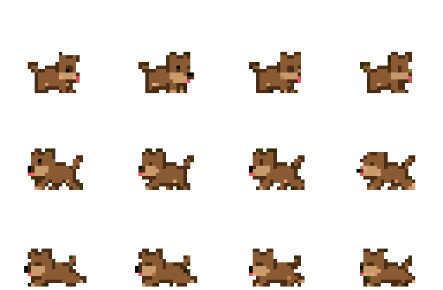

# DogiPet

DogiPet adalah anjing piksel yang hidup di desktop Windows. Ia berjalan,
tidur, mengikuti kursor, bereaksi saat kamu mengetik, mengingatkan waktu
istirahat, dan merayakan saat AI agent selesai bekerja.

Proyek ini terinspirasi oleh konsep desktop pet, dengan karakter, sprite,
kode, suara, dan identitas Dogi sendiri. Mulai v0.5.2, semua gerakan memakai
sprite PNG pixel-art transparan dari lembar karakter referensi yang disetujui.



## Aplikasi dan Control Center

DogiPet bukan sekadar script Python. Repository ini menghasilkan aplikasi
Windows `DogiPet.exe` dan installer `DogiPet-Setup.exe`. Saat aplikasi dibuka,
Control Center native tampil untuk mengatur Dogi; jendela bisa disembunyikan
sementara desktop pet tetap aktif.


## Fitur saat ini

- Animasi pixel-art empat frame yang tajam untuk tiap aksi utama.
- Mengejar kursor yang bergerak cepat.
- Menoleh mengikuti kursor; bila kursor digerakkan kanan-kiri berulang dengan
  cepat, Dogi menjadi pusing lengkap dengan animasi spiral.
- Animasi bingung memakai transisi ping-pong yang lebih halus dan lambat.
- Ikut mengetik di laptop mini saat kamu mengetik.
- Ikut menggerakkan indikator laptop saat kamu scroll ke atas atau bawah.
- Mengenali jendela Zoom, Teams, Google Meet, Webex, dan call lain; Dogi
  menghadap ke posisi meeting, menggonggong sekali, lalu sesekali mengawasi.
- Mengajak istirahat bila kamu terdeteksi aktif nonstop terlalu lama
  (ambang 45/60/90 menit bisa diatur di halaman Fokus).
- Klik untuk mengelus; saat di-drag Dogi berubah ke pose digendong dengan kaki
  berayun, lalu mendarat ceria ketika dilepas.
- Beri tulang, tambah hingga empat Dogi, dan interaksi antarteman.
- Kebutuhan Dogi (kenyang, energi, senang) yang memengaruhi tingkahnya —
  beri tulang, elus, dan biarkan ia tidur agar tetap ceria.
- Sadar waktu: sapaan selamat pagi, pengingat makan siang, dan lebih sering
  tidur di malam hari.
- Enam tema warna bulu dan empat gaya suara gonggongan (Klasik, Kecil,
  Besar, Senyap) dengan pratinjau di halaman Tampilan.
- Timer Pomodoro dan pengingat peregangan.
- Reaksi status AI agent, dengan pemasangan hook Claude Code sekali klik
  dari Control Center (halaman Agent AI).
- Control Center native untuk preview, aksi cepat, personalisasi, fokus, dan
  pengaturan Reaksi serta pembaruan.
- Installer Windows dengan pilihan startup.
- Pembaruan aman dari GitHub Releases dengan verifikasi SHA-256.

## Menjalankan dari VS Code

Butuh Python 3.11 atau lebih baru.

```powershell
python -m venv .venv
.venv\Scripts\Activate.ps1
python -m pip install -r requirements.txt
python dogi.py
```

Klik kanan Dogi untuk membuka menu fitur dan pengaturan.

## Build aplikasi Windows

Build lokal membutuhkan dependency pengembangan dan Inno Setup 6.

```powershell
python -m pip install -r requirements-dev.txt
.\scripts\build_windows.ps1
```

Hasil build:

- `dist/DogiPet.exe` — executable mandiri.
- `release/DogiPet-Setup.exe` — installer Windows.
- `release/DogiPet-Setup.exe.sha256` — checksum updater.

## Sistem pembaruan otomatis

DogiPet memiliki dua kanal pembaruan:

- `continuous` — setiap push kode ke branch `main` membuat ulang rolling
  release `continuous`. Ini kanal default agar perubahan di GitHub segera
  terdeteksi oleh aplikasi terpasang.
- `stable` — hanya mengambil GitHub Release terbaru yang dibuat dari tag versi
  seperti `v0.1.0`.

Saat versi/build baru tersedia, DogiPet meminta konfirmasi, mengunduh installer,
memverifikasi SHA-256, menjalankan installer secara senyap, lalu menutup proses
lama. Kanal dan pemeriksaan otomatis dapat diubah melalui klik kanan →
**Pembaruan**.

### Membuat stable release

1. Ubah `VERSION` di `version.py`.
2. Commit dan push perubahan.
3. Buat tag dengan versi yang sama.

```powershell
git tag v0.2.0
git push origin v0.2.0
```

Workflow `release.yml` akan menguji aplikasi, membangun installer Windows, dan
menerbitkan aset yang diperlukan updater.

## Integrasi AI agent

Cara termudah: buka Control Center → halaman **Agent AI** → **PASANG HOOK**.
DogiPet menulis hook `UserPromptSubmit` (thinking) dan `Stop` (done) ke
`~/.claude/settings.json` tanpa mengusik hook lain, dan bisa dilepas kembali
dari tombol yang sama.

Untuk agent atau editor lain, jalankan perintah berikut dari hook pilihanmu:

```powershell
python dogi_hook.py thinking
python dogi_hook.py done
```

Status ditulis secara lokal ke `~/.dogi/agent_status.json`. Dogi tidak
mengirim isi prompt, ketikan, atau data penggunaan ke server mana pun.

Deteksi meeting juga lokal dan konservatif: DogiPet hanya memeriksa nama app,
judul jendela, serta posisinya. Kamera, mikrofon, peserta, dan isi meeting tidak
pernah dibaca.

## Data lokal

Konfigurasi, suara sintetis, status agent, dan installer sementara tersimpan di
`~/.dogi/`. File `config.json` menyimpan tema, pengingat peregangan, serta
preferensi pembaruan.

## Pengembangan

Jalankan pemeriksaan sebelum commit:

```powershell
python -m unittest discover -s tests -v
python -m py_compile dogi.py updater.py dogi_hook.py agent_hooks.py
```

Repository: <https://github.com/1oneGod1/DogiPet>

### Mengimpor ulang lembar sprite

Lembar sprite chunky disimpan di
`assets/reference/dogi-chunky-sprite-sheet-v051.png`. Untuk mengekstrak ulang
seluruh animasi transparan dan enam variasi tema:

```powershell
python scripts/import_reference_sprites.py assets/reference/dogi-chunky-sprite-sheet-v051.png
```
